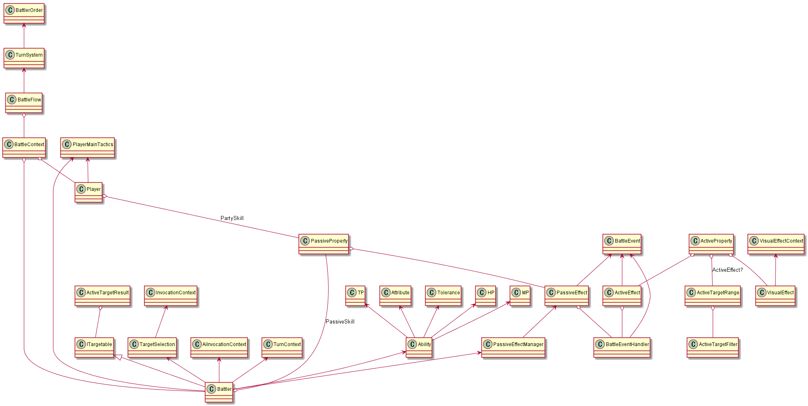

# ゲームシステム共通化

## 調査方針

以下の3つのターン制コマンド型ゲームは、ゲームが成り立っている
* 逃亡性痛み症候群
* メメントソーラ
* メテオモンスター

これらに登場するクラスをすべて集め、どのクラスの組が共通していて、どれが共通していないかをまとめる。

## あるか、無いか

細かい違いは無視

* A: 同じ性質のものがただ1つある
* B: 似た性質のものはある
* C: 別のものに吸収されている
* D: 分割されている、バリエーションが複数存在する
* E: 無い。今は追加する予定もない
* F: 無いが、追加する予定がある

### システム

||PainRpg|MementoSola|MeteoMonster|ツクール|
|-|-|-|-|-|
|`BattleContext`|A|A|A|?|
|`MasterData`|A|A|F|?|
|`Player`|B|F|A|?|
|`Battler`|A|A|A|A|
|`BattleEvent`|E|A|A|?|
|`BattleEventHandler`|E|A|A|?|
|`ActiveEffect`|A|A|A|C|
|`PassiveEffect`|A|A|F|A|
|`ActiveProperty`|D|A|A|C|
|`PassiveProperty`|D|D|F|A|
|`ActiveTargetRange`|E|A|F|A|
|`ActiveTargetResult<T>`|A|A|A|E|
|`ActiveTargetFilter`|B|A|A|B|
|`ITargetable`|E|A|A|E|
|`InvocationContext`|A|A|A|B|
|`AiInvocationContext`|E|A|E|B|
|`TargetSelection`|A|A|A|B|
|`TurnContext`|A|A|E|?|
|`BattleFlow`|A|A|A|A|
|`VisualEffect`|A|A|F|A|
|`VisualEffectContext`|E|A|F|?|
|`PassiveEffectManager`|A|E|E|A|
|`PlayerMainTactics`|A|A|C|B|
|`Attribute`|A|A|A|B|
|`Tolerance`|A|E|B|B|
|`HP`|A|E|A|A|
|`MP`|E|E|E|A|
|`TP`|B|B|B|A|
|`BattlerOrder`|B|E|E|A|
|`TurnSystem`|A|A|A|A|

### エンティティ

||PainRpg|MementoSola|MeteoMonster|
|-|-|-|-|
|Ability|A|A|A|
|EnemyAbility|A|A|E|
|EnemyParty|A|F|E|
|Skill|A|A|A|
|Item|A|E|E|
|Status|A|F|A|
|PassiveSkill|A|E|A|
|Environment|E|D|E|
|VisualEffect|A|A|A|
|PartyStatus|A|E|E|

## 各システムの関係



## 各システムの考察

より末端の概念から順に考察していく。

### InvocationContext/TargetSelection

この2つは近い役割を持つ。段階的なメニューのことである。
段階的なメニューは「前の段階のメニューが機能以外の情報を持つかどうか」によって
2種類に分かれる。

機能以外の情報を持つメニューとは、例えば
* スキル
* アイテム
* 行動者

こういったものをメニューから選択すると、
メソッド呼び出しで伝搬させる必要のある情報は増えていく。
一方で、何を選択してもその後要求される機能はほぼ同じ。
（少なくとも、スキルの特性などを発現するタイミングまでは。）

逆に、機能以外の情報を持たないメニューとは、例えば
* たたかう/にげる
* スキル/アイテム

これらは選択の度に情報が増えていくことが無い。
一方で、選択したものによってその後要求される機能が異なる。

InvocationContextはスキルの発現、TargetSelectionはターゲット選択だが、
仮にこれとは別のメニューを表示するとしても似た実装で実現することができる。

### ActiveTargetResult

ゲームによっては、スキルなどの対象にできるものが複数数種類ある。
「メメントソーラ」では、地形に配置される**パネル**や**置物**が対象に取れる。
こういった対象は`ITargetable`インターフェースで共通化してもよいが、
共通の機能を持つとは限らない。
メメントソーラの場合は、どの対象も座標を持つ。

そうでなくても、選択対象には選ぶ単位に応じて以下のようなバリエーションがある。
* 一体
* 複数選択
* 自分
* 全体
* 自分一体と敵一体
* 敵一列
* 「〇〇からランダムにN体」は、〇〇をターゲットとするスキルと変わらない

他にも、幾何学的な範囲を持つ場合がある。
* 周囲１マス
* 周囲１メートル
* 東に太さ1メートル、長さ3メートルの直線

こういった範囲効果は、上記の「選択対象」で選んだ対象の位置を基準とする場合もある。

`ActiveTarget`の概念は`ActiveEffect`の存在を前提としている。
特定の`ActiveEffect`は、特定の構造を持つ`ActiveTargetResult`のみを
受け付ける場合がある。
置物が対象のスキルは、バトラーに対して適用することはできない。

複数ターゲットの各要素に対して、
単体ターゲットの効果を及ぼすことはできる。

それから、`ITargetable`を実装するクラスはゲーム要素として対等とは限らない。
例えば、「持っているアイテムを複数選んで使う」コマンドがスキルとは別にあるならば、
そこにもこのターゲット選択システムを流用できるかもしれない。

### ActiveTargetFilter/ActiveTargetUnit

選択対象といえば、「敵一体」を選択する場合と「味方一体」を選択する場合では、
戦略が異なる。

この差異を表現するために、`ActiveTargetResult`で述べた選択対象のバリエーションとして、
* 敵一体
* 味方一体
* 敵全体
* 味方全体

などが考えられる。すると、「一体」「全体」「複数」などの対象に対して、
掛け算的に「敵」「味方」などのクラスを差し込めばよい気がするが、それは誤りかもしれない。
以下のような対象は、そのような区分に入らない可能性がある。
* 自分
* 敵味方全員

ここまでの方法で実現するならば、
* 「自分」はあくまで自分という選択肢の中から選ぶ
* 「敵味方全員」はあくまで敵味方全員という選択肢の中から選ぶ

と解釈すればよいかもしれない。

ひとまず、ここでは以下の2つの情報があれば、
効果対象の操作を提示するために十分であると言える。
* どの選択肢の中から選ぶか？ (`ActiveTargetFilter`)
* どれくらい選ぶか？ (`ActiveTargetUnit`)

また、敵や味方はどちらも同じバトラー型である可能性が高いが、
設置物やアイテムをターゲットとする場合は型が異なるため、
やはり`ITargetable`のコンテナを生成する必要がありそうだ。

### Attribute/Tolerance

ダメージ属性システムはRPGに頻出である。
「メメントソーラ」では、ダメージ属性は存在しない。

「逃亡性痛み症候群」「メテオモンスター」では、`DamageAttribute`列挙体と、
`Tolerance`クラスを用いてこれを表現する。
そのクラス構造は毎回似たようなものになる。以下のような機能を持つ：
* 各属性に対して、耐性値をプロパティで持つ。
* インデクサーを通じて、列挙子から耐性値を引くことができる。
* コンストラクターから全属性耐性を設定できる。

ダメージ計算や属性の種類は毎回異なるが、
ダメージ属性の列挙子から`Tolerance`クラスを生成できないだろうか？

同時に、「属性付きのダメージを及ぼす`BattleEvent`」も自動生成できる可能性がある。

### BattleEvent/BattleEventHandler

バトルイベントは、戦闘中に発生するあらゆるイベントのことである。
これらはプレイヤーやAIが決定した作戦に反応して生じる。

バトルイベントを用意する意図はいくつかある。
* バトルイベントにフックして別の処理を発生させたい。
    * 特に、あらゆるイベントの直後には相手のHPがゼロになったかの確認を入れるべき。
* ダメージや状態付与など、多くのアクティブ効果などが及ぼすであろう効果を共通化しておきたい。
* バトルイベントをサーバー・クライアント間でやりとりしたい。

「逃亡性痛み症候群」ではこの概念が発達していなかったが、
「メメントソーラ」「メテオモンスター」では活用している。

フック処理の起点とする用途を考えると、
イベントはネストしてもよいことにする必要があるかもしれない。
たとえば、「攻撃イベント」と「ダメージイベント」は、
攻撃イベントからダメージイベントへ依存するという関係がある。

こうしたネスト関係は、単にバトルイベント内の処理から
イベントハンドラーへアクセスできるだけで実現できると考えられる。

バトルイベントをパッシブ効果でフックする際、
バトルイベントが対象となるバトラーなどを持つかどうかによって、
引き起こされるパッシブ効果のグループを制限する可能性がある。
バトルイベント自体が、対象を持つか否か、持つとしたら誰なのかを
知るための情報を取得できる必要がありそうだ。

### ActiveEffect/ActiveProperty

ターン制コマンドRPGの「コマンド」の部分である。

基本的に以下の機能を持つ：
* ターンごとの作戦としてプレイヤーが選択し、戦闘イベント(ダメージなど)を起こす。
* 効果を発揮する前に、ターゲット選択が必要。

`ActiveProperty`はスキルやアイテムなどを表現する。
スキルには回数制限が無いことが多いが、アイテムにはMPコストが無いことが多い。
そのような違いがあっても、スキルとアイテムは共にアクティブ効果を発揮できるリソースである。

`ActiveEffect`は効果そのものである。
もしスキルにMPコストがあって、コストの異なる複数のスキルがあったとしても、
効果が共通ならば`ActiveEffect`の実装を増やす必要がない。
そのため、一般には`ActiveProperty`とは独立である。

`ActiveProperty`は以下の情報を持つ必要がありそうだ：
* ターゲット選択に用いる`ActiveTargetFilter`や`ActiveTargetUnit`
* 効果を表現する`ActiveEffect`

また個性的なスキルが多数登場するRPGならば、
ある特定の効果を持つスキルはゲーム中でほぼ完全にユニークかもしれない。
その場合、`ActiveEffect`クラスを作らず、
`ActiveProperty`そのものが効果を表現するという手もある。

### PassiveEffect/PassiveProperty

ターン制コマンドRPGでは、バトラーに状態として付与され、
戦闘中ずっと効果を及ぼすものがある。
「状態異常」「パッシブ効果」などと言われる。

パッシブ効果に対しては実装のバリエーションが多くあり、
例えば以下のようなものの組み合わせである：
1. 自然解除条件がある。
    * 特に、ターン経過で解除されるものはさらに状態を持つ必要がある。
1. 重ねがけができる。
1. 逆の効果を持つパッシブ効果によって相殺される。
1. 効果を剥がす特定のスキルが有効かどうかのグループ分けがある。
1. 効果を発揮する様々なタイミングがある。
1. 効果は数種類に分けられる。
    * バトラーなどのリソースの持つパラメータを補正するタイプの効果がある。
    * スキルの効果などの最中に、別の効果を差し込む効果がある。
    * スキルの処理やバトルの流れを変えてしまう効果も考えられる。（二回行動など）
1. 効果を付与する対象となるリソースにバリエーションがある。どれにかかっているとしても、決まったタイミングがくれば一括で効果を発揮できる必要がある。
    * バトラー
    * 装備
    * パーティ全体
    * 場
    * 設置物
    * パッシブスキル

これらのパッシブ効果を、`PassiveEffect`,`PassiveProperty`という
二段階に分けたクラスで表現できる。
`PassiveEffect`は状態の処理を担い、
`PassiveProperty`は状態の状態を保持する
（持ち主や、効果が終了したかどうかのフラグなど）。

#### 自然解除条件がある/重ねがけができる

眠り状態とか、一定ターン以内でしか続かない効果なら、
メインとなる他の効果と同様に、フックするメソッドを利用して判定すればいい。
そのためにも、`PassiveEffect`は親である`PassiveProperty`を
消滅させる権限を持つ必要がある。

厄介なのは、パッシブ効果の自然解除条件などで状態を持つ必要がある場合である。
例えば、一定ターンが経つと消えてしまう強化などである。

`PassiveEffect`はパッシブ効果の特徴を入力したデータベースのレコードである。
それゆえに、これ自体が状態を持つことはできない。
これの状態が変わることは、データベースのレコードが実行中に変わってしまうということであるからだ。

そこで、その親として`PassiveProperty`を用意すると解決できる。
状態の持つ状態は、このクラスが持つことになる。
`PassiveEffect`の各実装クラスに対して、
`PassiveProperty`も特有の実装クラスを持ったり持たなかったりする。

依存関係は`PassiveProperty`から`PassiveEffect`への物である必要があり、
かつ`PassiveEffect`が`PassiveProperty`への参照を持つので、
循環依存になるという問題がある。
かといって、特定の`PassiveEffect`が必要とする情報は
特定の`PassiveProperty`にしか持ち得ないため、問題はないかもしれない。

#### 逆の効果を持つパッシブ効果によって相殺される

これを実現するには、新たにかかる別のパッシブ効果のパラメータを変更したり、
新たにかかる方のパッシブ効果を阻止する機能が必要になる。

まだ考察は十分ではない。
「逃亡性痛み症候群」では`OnRaising`なるイベントをフックして、
そのメソッドで`bool`を返すことで、新たな状態異常にかかるかどうかを決めることができる。

#### 効果を発揮するタイミング/効果の種類

パッシブ効果の処理は、バトルの通常の流れをひっかける形で始まる。
「ターン開始」「ダメージを受けた直後」などである。

こうした効果は、`PassiveEffect`クラス内のメソッドとして実装される。
このメソッドは、バトルイベントの直前直後、あるいは最中などにおいて、
ひっかける形で呼ばれる必要がある。

ひっかける処理を呼ぶ必要性があるのはパッシブ効果クラス側の都合であり、
バトルイベントやゲームフロー側の都合ではない。
したがって、バトルイベント側などには一切記述を追加せずに済むか、
可能な限り簡単にひっかけられる必要がある。

案としては、各効果が「ひっかけるタイミングの情報」を持つことが考えられる。
今やバトル中のダメージなどはバトルイベントクラスで表現されるため、
イベントハンドラーがバトルイベントの型を見て、
存在するフック効果の対応する型と比べ、一致している場合、
さらに「直前なのか直後なのか」のフラグを読み取り、
実行するタイミングを決めることができる。

あるいは、バトルイベントの最中に呼ばれることがあるかもしれない。
この場合、バトルイベント自身がパッシブ効果の影響を受けるような処理を
主体として行うはずである。
それは主に、バトラーの能力値の補正を反映したい、
などのモチベーションによるかもしれない。

この場合、バトラーが「最終的な能力値を提供するクラス」を持つとよいかもしれない。
この内部では、能力値を読み取るためにはパッシブ効果による補正が自動的に適用される。

ひっかけるタイミングの情報をどのように持つべきだろうか？
辞書を用いて、キーを条件、値をフック処理のデリゲートとして扱い、
ハンドラーに登録しておくとよいかもしれない。

また、効果の種類はゲームのルールによって全く異なる。
それに、フックするメソッドに必要な引数も違うかもしれない。
存在する情報を最大限取り込むとするなら、以下のような情報が使える。
* きっかけとなったバトルイベント
* BattleContext

#### 付与する対象

パッシブ効果は様々な対象に付与することができる。
効果の情報を持たせるだけであれば、対象となるクラスにメンバーとして持たせるだけでよい。
ただし、効果を発揮するためには存在する全ての効果を収集する機能が必要になる。

また、常に全ての効果が発揮されるわけではない。
例えば、「ダメージを受けた時」というフック効果は、特定のバトラーに所属する。
このとき、ダメージを受けた主体となるバトラー以外の持つ
「ダメージを受けた時」効果は発揮されないはずである。

多くの場合、パッシブ効果はグループに分かれる。例えば、
* バトラーは「状態異常」パッシブ効果のリストを持つ。
* バトラーはパッシブスキルのリストを持つ。
* 防具はパッシブ能力のリストを持つ。
    * 防具はバトラーに所属する。
* 「場の状態」はパッシブ効果のリストである。
* パーティの状態はパッシブ効果のリストである。

こうしたグループのリストの中から、適切な実行対象を選ぶシステムが必要になる。
実行するグループとフックする処理は独立なので、互いに影響せずに選べるはず。

ダメージ処理などの対象者が決まっているバトルイベントに対しては、
対象となるバトラーに所属するパッシブ効果が反応すればよいはず。
ターン終了など対象者が決まっていないバトルイベントに対しては、
バトラー・場の状態・パーティの状態すべてのパッシブ効果が反応すればよいはず。

### Battler

バトラーはゲームの主体であるようでいて、実際にはさらに上位の「プレイヤー」に属する概念である。

バトラーに所属する属性は多岐にわたる。
* HP/MP/TPなどの数値
* スキル/アイテムなどのリソース
* パッシブ効果
* 能力値

能力値は少し特別な存在で、このクラスの内容自体はイミュータブルなものである。
バトラーに所属する他の属性は、基本的にミュータブルなものになる。

ミュータブルなデータは基本的に変更をビューに通知し、
UIを更新しなければならないため、何らかの通知手段を用意する必要がある。

バトラーは状況に応じて異なる姿・ふるまいでメモリ上に存在する。
* 非プレイ中は、セーブデータの中に「BattlerRecord」として存在する。
* プレイ中は、「Battler」が存在する。
* 戦闘中は、Battlerのパラメータがダイナミックに変化する。

### TurnProcessor/BattlerOrder

各ターンの流れを制御する必要がある。
これもバリエーションが多くあるが、以下のようになるかもしれない：
* 行動順を元に、行動するバトラーを決定する。
* プレイヤーは、バトラーの作戦の方針を入力する。
* プレイヤーは、バトラーのスキルを入力する。
* プレイヤーは、バトラーのスキルの対象を入力する。
* スキルが発動される。
* バトルイベントを処理する。
* バトルイベントをフックしてパッシブ効果が発揮される。
* ターン終了などの必ず実行されるバトルイベントを処理する。
* バトルイベントが全て終了して、次のバトラーへ移る。

以下の段階は、「機能コンテキスト」か「情報コンテキスト」を新しく生じる。
* バトラーを決定する(情報コンテキスト`TacticsSelectionContext`)
* メイン作戦を入力する(機能コンテキスト`SkillSelectionContext`)
* スキルを入力する(情報コンテキスト`TargetSelectionContext`)
* ターゲットを選択する(情報コンテキスト`InvocationContext`)
* スキルを発動する(バトルイベント)

最初に「バトラーを決定する」を行うわけだが、この段階自体はだれが発火するのだろう？
`TurnProcessor`なるクラスを用意して、そこで行うと良いかもしれない。

ターンの流れを別のクラスへ適切に委譲する機能は、
バトラーの行動順序を制御する機能とは別物なので、別々のクラスとして扱う。
バトラーの行動順を制御するのは`BattlerOrderDeterminator`の責務である。

また、バトラーの行動を入力してすぐに発動するのではなく、
全員の行動が入力されてからすべてが順番に処理される可能性もある。
この場合は`InvocationContext`をどこかに蓄えておく必要がある。

こうした状況に対しては行動順を制御するクラスの関わり方も異なるはずである。
作戦を決定した直後に行動するならば、最初に`Battler`に対して行動順を決定して、
`TurnProcessor`はその順に`TacticsSelectionContext`を生成する。

一気に行動を処理するならば、`TurnProcessor`がUXに適した順で入力を受け付け、
`InvocationContext`を集約した`PlayerTacticsContext`的なものを生成する。
`TacticsSelectionContext`は`Battler`を見て行動順を決定するが、
`TurnProcessor`はそれを`InvocationContext`の実行順として扱う。

### BattleFlow

戦闘処理のエントリポイントである。

勝利条件の判定と、勝敗を呼び出し元へ返す責任がある。

勝敗は、バトルイベントの処理が終了した時点で
他のバトルイベントが残っているまま決まることがある。
兄弟イベントが残っているだけかもしれないが、
親イベントが残っている場合もあるので、うまく中断して`BattleFlow`に戻る必要がある。

この部分についての考察は不十分である。

例外を投げれば再帰的に脱出できるが、適切な方法とはいえない。
`BattleEventHandler`が処理を中断してboolを返し、
それを見た`InvocationContext`もboolを返し、
なんやかんやで`TurnProcessor`まで戻ってくることになる。
最後に`TurnProcessor`を中断して脱出すれば、
`BattleFlow`によってハンドリングすることができる。

`TurnProcessor`の説明で紹介したように、
ターンの流れはゲームごとに全く異なる。
一部の中断処理はプログラマーが手動で制御する必要があるかもしれない。

## 自動生成方針

ここまでの考察では、戦闘に関する要素は以下のように分けられる。
* エントリポイントと決着処理
* ターンの流れ
* バトラーの行動順の決定
* 機能コンテキストと情報コンテキスト
* アクティブ効果対象フィルター/単位
* アクティブ効果選択結果
* 属性と耐性
* アクティブ効果/アクティブリソース
* パッシブ効果/パッシブリソース(パッシブインスタンス)
* バトラー
* バトルイベント/バトルイベントハンドラー

何を起点に何を生成できるのかを考察する。

### パッシブ効果

`PassiveEffect`抽象クラスを手動で書いたとしたら、
それは以下のようになるだろう。

```csharp
enum PassiveEffectTiming
{
    BeforeEvent, AfterEvent
}

[PassiveEffectClass]
abstract class PassiveEffect
{
    [TriggeredEffect(PassiveEffectTiming.BeforeEvent)]
    public abstract Task OnDamaged(DamageEvent @event, BattleContext context);

    [ValueModifier]
    public abstract int ModifyDefence(int source, BattleContext context);
}
```

前述のとおり、パッシブ効果には2種類の効果がある。

バトルイベントをフックして始まる効果は、`TriggeredEffect`属性を付ける。
引数は必ず、バトルイベントクラスのインスタンスと、
`BattleContext`のインスタンスである。

パラメータを補正する効果は、`ValueModifier`属性をつける。
引数は必ず、元の値と、`BattleContext`のインスタンスである。

このソースコードを元に、以下のものを生成できるだろう。
* バトルイベントの型からデリゲートへのマップ
* 「最終的な能力値」クラス

#### フックマップ

バトルイベントのフック設定は、以下のように生成される。

```csharp
using static PassiveEffectTiming; 
using HookCondition = (Type, PassiveEffectTiming);
using PassiveHookingEffect = Func<PassiveEffect, Func<BattleEvent, BattleContext, Task>;

hookSettings = new Dictionary<HookCondition, PassiveHookingEffect>()
{
    [(typeof(DamageEvent), BeforeEvent)] = p => p.OnDamaged,
    // その他のフック効果が続く
};
```

Funcの引数部分は共変ではないため、この方法は上手くいかないかもしれない。
「メテオモンスター」のクライアント側でしているように、
パターンマッチングのswitch文/if文で処理する必要があるかもしれない。

あるいは、「イベント処理用メソッドは全て名前が`BeforeEvent`/`AfterEvent`」と決めてしまえば、
C#のオーバーロード解決システムに任せることができそうだ。
その場合、フォールバックとなるメソッドが必要になるかもしれない。

……と思ったが、型が静的に確定できないので、オーバーロードは常にフォールバックのものが呼ばれそう。
`dynamic`型を使ってディスパッチするという手はある。
この方法なら、コード生成はゼロで済む。

```csharp
class BattleEventHook
{
    private PassiveEffect[] effects;

    public Task BeforeEvent(BattleEvent @event, BattleContext context)
    {
        dynamic eventDynamic = @event;
        foreach(var efk in effects)
        {
            efk.BeforeEvent(eventDynamic);
        }
        // 実際にはバトルイベントの主体に応じて、パッシブ効果グループをフィルターすべきかも
    }
}
```

dynamicによる動的コード生成は、`PassiveEffect`の派生型ごとに生成されるだろうか？
その場合はパフォーマンスが心配……
→動的コード生成を実行するコードはあくまで静的に生成されるので、
パフォーマンス的には最初の一回だけで済みそうだった。

dynamicでやるのはいいが、特定のバトルイベント型に一致するフックが
存在しない場合があるので注意が必要。

ひとまず、`BattleEventHook`自体は生成でまかなうことに。

#### 最終的な能力値クラス

最終的な能力値クラスは、以下のように生成される。
これを生成するには、バトラーの設計も判明している必要がありそうだ。
あるいは、`ValueModifier`属性に対象となるプロパティ名を知らせることでも生成できる。

```csharp
class FinalAbility
{
    Ability sourceAbility;
    PassiveEffectGroup passives;

    public int Defence
    {
        get
        {
            return passives.Aggregate(sourceAbility.Defence, p => p.ModifyDefence);
        }
    }
}
```

懸念点としては、値をマッピングする対象はバトラーの能力値だけではないかもしれないこと。
生成元コードにクラス分けの情報が欲しい。

#### PassiveEffectクラス自体を生成

PassiveEffectクラスは決まった構造をしているので、自動生成できるかもしれない。
以下のような設定ファイルを使えそうだ。

```csharp
var triggers = new List<HookingEffect>()
{
    new (typeof(DamageEvent), BeforeEvent, "OnDamaged"),
};
var modifiers = new List<ModifierEffect>()
{
    new (typeof(int), nameof(Ability.Defence)),
};
```

以下のような定義方法ならよりシンプルかもしれない。
フックイベントとマップイベントは別クラスに分ける。
マップイベントも、その値のコンテナごとに分ける。

```csharp
[PassiveEffectTriggers]
class PassiveEffectTemplate
{
    // IBattleEvent 実装クラスのフィールドはフックイベント化
    // フィールド名を見てフックのタイミング(Before/After)を決める
    public DamageEvent BeforeEvent;
}

[PassiveEffectSelectors]
class PassiveEffectSelectors
{
    [SelectorsSourceType]
    BattlerAbility ability;
    // BattlerAbility.Defence フィールドが対象となる
    public int Defence => ability.Defence;
    // BattlerAbility.Tolerance.Fire フィールドが対象となる
    public int Fire => ability.Tolerance.Fire;
}
```

あるいは、`BattlerAbility`自体に生成元として扱う属性をつけることもできそうだ。
マップ対象クラスが、さらにマップ対象クラスをネストしている場合はどうしよう？

#### パッシブ効果の状態ストア

前節では`PassiveProperty`の責務として、
パッシブ効果自体が持っている状態を保持することを挙げた。
これを改名して`PassiveAttachment`と呼ぶことにする。

`PassiveAttachment`は基底となるクラスがあり、
状態を持たないパッシブ効果はこれに保持される形でバトラーに付与される。
追加の状態を持たせたければ、この基底クラスを継承したクラスを作ればよい。

また、パッシブ効果には永続のものもあるため、
パッシブ効果だからといって必ず`PassiveAttachment`を伴うとは限らない。

#### パッシブ効果の状態ストア (2020/10/15)

`PassiveAttachment`なるクラスが状態を持つとして、
それを`PassiveProperty`側へ渡す方法が無い。
`PassiveProperty`は基底クラスであるため、`PassiveAttachment`の派生クラスがあったとしても
イベントを起こす際に`PassiveProperty`の派生クラスとしてメソッドを呼び出す方法が無いからである。

`PassiveProperty`自体に状態を持たせた方がよいかもしれない。
シリアライズされるデータは別に持つ。
すなわち、データ側が振る舞いを保持する形でクラス分けをしていたが、
振る舞い側がデータを保持するようにする。

### ターゲッティング

#### ターゲットフィルター

ターゲットフィルターは以下のようなクラスだ。
これをフィルターごとにいくつも作る。

```csharp
class RivalTargetFilter : IActiveTargetFilter
{
    public bool IsMatch(ITargetable target, TargetSelectionContext context)
    {
        if (context.Doer.IsPlayer)
        {
            return context.Enemies.Contains(target);
        }
        else
        {
            return context.Players.Contains(target);
        }
    }
}
```

クラスをたくさん書くのは面倒だが、メソッドをたくさん書くのは許容できるかもしれない。
以下のようなクラスを書いて生成元とできそうだ。

```csharp
[TargetFilterLibrary]
class TargetFilterLibrary
{
    public static bool IsRival(ITargetable target, TargetSelectionContext context)
    {
        // いろいろする
    }
    public static bool IsItem(ITargetable target, TargetSelectionContext context)
    {
        // いろいろする
    }
}
```

この程度のコードであればコード スニペットあるいはリファクター程度で満足できそうでもある。

#### ターゲットユニット

ターゲットユニットは単なるコンテナだ。

```csharp
class PluralTargetUnit : ITargetUnit<Battler>
{
    public Battler[] Targets { get; }
}
```

以下のようなクラスを元に、複数のクラスをまとめて生成できるかもしれない。

```csharp
[TargetUnitLibrary]
class TargetUnitLibrary
{
    public static IEnumerable<(Type, string)> GetPluralMembers()
    {
        yield return (typeof(Battler[]), "Battlers");
    }
    public static IEnumerable<(type, string)> GetPluralItemMembers()
    {
        yield return (typeof(Item[]), "Items");
    }
}
```

あるいは、将来レコード型を使って簡単に書けるようになるかもしれない。

```
data class PluralTargetUnit(Battler[] Targets) : ITargetUnit<Battler[]>;
data class PluralItemTargetUnit(Item[] Targets) : ITargetUnit<Item[]>;
```

または、`ITargetable`かその配列のいずれかを
型引数に取るだけの具象クラスでも多くのシナリオをカバーできそうだ。

```csharp
class SingleTargetUnit<T> : ITargetUnit where T : ITargetable
{
    public T Targets { get; set; }
}
class PluralTargetUnit<T> : ITargetUnit where T : ITargetable
{
    public T[] Targets { get; set; }
}
class MateAndRivalTargetUnit : ITargetUnit
{
    public Battler Mate { get; set; }
    public Battler Rival { get; set; }
}
```

それから、考察では`ITargetUnit`は`ActiveTargetResult`に含まれる予定だったが、
`ITargetUnit`を生で使う方がきれいになりそうだ。

#### ターゲッティング戦略

特定の`ActiveEffect`は、特定の`ITargetUnit`をターゲットとして要求する。
例えば、`SingleTargetUnit`と`PluralTargetUnit`を
同時に受け付けるような`ActiveEffect`は使わない。

`ActiveEffect`が主体となって、`TargetingStrategy`から
どのように選択方法を提示するかを決める。

```csharp
abstract class TargetingStrategy
{
    public abstract SingleTargetUnit<T> SelectSingle<T>(T[] choice, TargetSelectionContext context);
    public abstract MateAndRivalTargetUnit SelectMateAndRival(T[] mates, T[] rivals, TargetSelectionContext context);
}
```

これは、`ITargetUnit`ひとつにつき`TargetingStrategy`のメソッドも1つあるということである。
これではミスしやすいので、一方をコード生成に任せたい。
`ITargetUnit`から`TargetingStrategy`へ向けるのがよいだろう。

`ITargetUnit` は `ActiveEffect.InputTarget` メソッドから返すときに
`ITargetUnit` インターフェース型へアップキャストされる。
`InvocationContext` に包まれて `ActiveEffect` へ戻ってくる際にアンラップして使うこと。

#### Visitorパターンを利用できるか？

2020.09.17

プレイヤーへどのように選択肢を提示するかが、対象が敵なのか味方なのかによって異なるかもしれない。
注意すべきなのは、敵全体、敵一体、味方全体、味方一体、
どれにおいても異なるUIを提示する可能性があること。
この際 `ActiveTargetFilter`, `ActiveTargetUnit` が分かれていると、
両方の都合を考慮して提示方法を決定する処理が難しくなる。
要するにダブルディスパッチ問題である。

結局、この2つのクラス階層は統合すべきかもしれない。
以下の `ActiveTargetUnit` というクラスは、上記の同名クラスより狭い意味である。

```csharp
class SingleEnemyActiveTargetUnit : IActiveTargetUnit<SingleEnemyResult>
{
    public bool IsRange(ITargetable targetable, ITargeingContext context)
    {
        // predicate
    }

    public SingleEnemyResult InputResult(TargetingStrategy strategy)
    {
        // visitorパターン的にUIの提示方法を選択して入力を受け付ける
    }
}
```

`IActiveTargetUnit` がジェネリックになってしまっているのは懸念点。
このインターフェースを同じ型引数でもって実装するクラスは１つしか存在しないはずなので、無駄が多い。
`InputResult`メソッドはどうせクライアント側が型を分かった状態で使うはずなので、
`IsRange`メソッドだけがインターフェース規約でよいのかもしれない。

そもそも、どうやって利用側は型を分かって使うのだろう？
ターゲッティングを利用したい`ActiveEffect`などのクラスは、
ターゲッティング戦略としても具象型`SingleEnemyActiveTargetUnit`などを保持したいはず。

`SingleEnemyActiveTargetUnit`と対になる`SingleEnemyResult`はどうしても必要そう。

こうなると、生成でやりたい部分があまり残っていない気がする。
一方で依然としてパターンなので、なんとかして生成したい。
`IActiveTargetUnit` インターフェースを用意しておいて、
それに対して実装の追加リファクターでテンプレートを作る感じになるかもしれない。

あるいは、`ActiveTargetResult`の派生クラスを作成すると、
それに対するリファクターを通じて上記のようなクラスのひな形を作れるとよいかも。

#### インターフェースを用いて設計する(2020.10.19)

ターゲット選択のために以下のインターフェースを導入する。

- `IRangeProvider<TResult>`: ルールにより選ぶことのできないものを削ぎ落し、あり得るターゲットを絞り込む規約。
- `ITargetChooser<TRange, TResult>`: プレイヤーの選ばなかったものを削ぎ落し、結局選ばれたターゲットを絞り込む規約。
- `ITargeting<TResult>`: ターゲットを取得する規約。
- `TargetingComposer<TRange, TResult>`: `IRangeProvider`, `ITargetChooser`を合成して`ITargeting`の実装を作り出すクラス。

たとえば、 `IRangeProvider<Battler[]>` の実装は敵または味方バトラーの配列を候補として求める。

`ITargetChooser<Item[], Item>` の実装は複数のアイテムからひとつだけを選択する。

`TargetingComposer<Battler[], Battler[]>` は `IRangeProvider<Battler[]>` と `ITargetChooser<Battler[], Battler[]>` を合成することで `ITargeting<Battler[]>` を実装する。

現状、どこに静的コード生成が必要になるかは定かでない。
もしかしたら必要ないのかもしれないが、
ひとまず上記のライブラリを導入してゲーム開発を試してみたい。

### 属性耐性

プログラマーは以下のように属性を定義する。

```csharp
[DamageAttribute]
enum DamageAttribute
{
    Neutral, Fire, Water, Wind, Terra
}
```

以下のような属性耐性クラスを出力できる。

```csharp
class Tolerance
{
    public int Neutral { get; set; }
    public int Fire { get; set; }
    public int Water { get; set; }
    public int Wind { get; set; }
    public int Terra { get; set; }

    public int this[DamageAttribute attr] => attr switch
    {
        Neutral => this.Neutral,
        Fire => this.Fire,
        Water => this.Water,
        Wind => this.Wind,
        Terra => this.Terra,
    };
}
```

### コンテキストクラス

コンテキストクラスには以下のものがある。
* バトルコンテキスト
* リソースコンテキスト（上で情報コンテキストと呼んでいるもの）
* 機能コンテキスト

一部のコンテキストは戦闘処理の広い範囲に浸透するため、
多くの機能を自動生成するための前提となる。

コンテキストには順番がある。
1. `BattleContext`
1. `BattlerTacticsContext`
1. `SkillSelectionContext`
1. `TargetSelectionContext`
1. `SkillInvocation`

段階を進む際、リソースコンテキストが現れるたびに
前の段階で確定したリソースがコンテキストを通じて運搬される。
「どのような情報を含むのか」は推測して生成できるかもしれない。

どのようなコンテキストがどのような順番で出現するかは
ゲームごとに様々であり、予測はできない。
うまく定義を書ける方法が欲しい。

#### コンテキストの手動生成をしたくない

また、コンテキストクラスを作成したとして、
それを明示的に生成するのは手動となる可能性もある。
自動生成されるクラスを手動でインスタンス化するのは忘れてしまいそうだ。

まず、`BattleContext`はコンテキストにとってのエントリポイントであり、
ここは手動となる可能性が高い。

`BattlerTacticsContext`の生成が手動になるかどうかは、
`TurnProcessor`を書くのが手動になるかどうかにかかっている。

`TargetSelection`の生成が手動となるかどうかもやはり、
前の段階である`SkillSelectionContext`を書くのが手動になるかどうかにかかっている。

特定のリソースコンテキストは、
次のコンテキストを生成するメソッドを1つだけ持つことが多い。
機能コンテキストもほぼ同様だが、
こちらは他のコンテキストを複数生成し、
自分より下位の処理の流れを制御する責務を持っている。

#### リソースコンテキストの生成内容

以下のようなクラスから、

```csharp
[DerivedContext(baseContext= typeof(SkillSelectionContext))]
class TargetSelectionContext
{
    [ConcreteAttribute]
    public Skill Skill { get; }
    // 次の段階のコンテキストにミックスインしないプロパティを明示できる
    [ConcreteAttribute(doMixin= false)]
    public ITargetingStrategy TargetingStrategy { get; }

    // このコンテキスト独自の処理
}
```

以下のようなものを生成できるとよいかもしれない。

```csharp
partial class TargetSelectionContext
{
    public SkillSelectionContext BaseContext { get; set; }
    public Battler Doer => BaseContext.Doer;
    public BattleContext BattleContext => BaseContext.BattleContext;

    public TargetSelectionContext(SkillSelectionContext baseContext, Skill skill, ITargetingStrategy targetingStrategy)
    {
        BaseContext = baseContext;
        Skill = skill;
        TargetingStrategy = targetingStrategy;
    }
}
```

一方で、最初のベースとなる`BattleContext`クラスは以下のようになるかもしれない。

```csharp
class BattleContext
{
    [ConcreteAttribute]
    public Battler[] Players { get; set; }
    [ConcreteAttribute]
    public Battler[] Enemies { get; set; }
}
```

#### 機能コンテキストの生成内容

基本的にリソースコンテキストと同様で、新たなメンバーを持たないのが特徴である。
一方で、おそらく何らかのインターフェースを実装する必要があるという特徴もある。
他の機能を持つ別のコンテキストたちの選択肢から選ばれた結果生成されるからだ。

以下のようなコードを元に生成するだろう。

```csharp
[DerivedContext(baseContext=typeof(BattlerTacticsSelection))]
class SkillSelectionContext : IMainTacticsContext
{
    // このコンテキスト独自の処理
}
```

partialクラスは定義の片方だけでインターフェースの実装を明示することができるので、
これで十分対応できるはず。

#### コンテキストの流れをトップで制御

前述の通り、機能コンテキストにとっては自身より下位のコンテキストを用いた処理の流れを
制御する機能を持てるが、そうしないという手もある。

どのコンテキストも新たなコンテキストを生成するか、
バトルイベントを発生させて終了するかのどちらかである。
そこでこの手のコンテキストをインターフェースにまとめて、
while文で回してしまうことができそうだ。

```csharp
IBattleCommandContext prev = null;
IBattleCommandContext current = new BattlerTacticsContext();
while(true)
{
    var next = await current.DetermineNextContextAsync();
    if(next == null)
    {
        // キャンセルされたので、ひとつ前の選択へ戻る
        current = prev;
        continue;
    }
    else if(next.IsEndOfCommand)
    {
        // EndOfCommandコンテキストを返す。こいつは情報を持っているかもしれない
        // EndOfCommandとはInvocationなどかもしれない
        return next;
    }
}
```

ここでは`BattlerTacticsContext`から始めてみたが、
`TurnProcessor`に相当するものがコンテキスト扱いされてもよいかもしれない。

この、コンテキストの連鎖の流れを制御するクラスは完全にライブラリ化できるかもしれない。

例としては、以下のようにコンテキストの立ち位置を整理することができる。

|名前|リソース|機能|
|-|-|-|
|`BattleContext`|バトルの情報すべて||
|`TurnProcessor`||`BattlerTacticsSelection`を適切な順番で必要なぶんだけ作成|
|`BattlerTacticsSelection`|行動者|`SkillSelection`などを生成|
|`SkillSelection`||`TargetSelection`を生成|
|`TargetSelection`|スキル|`Invocation`を生成|
|`Invocation`|ターゲット|アクティブ効果を実行|

#### イベントハンドラーによるコンテキスト処理

`TurnProcessor`は複数のコンテキストを出力するため、
共通化が難しいかもしれない。
対処としては、バトルイベントハンドラーと同様の仕組みにするという手もある。

「前のコンテキストへ戻る」操作が必要なので、設計は少し複雑そう。
「前のコンテキストへ戻る」操作の後は、元のコンテキストを抜けなければならないが、
どう実現しようか？
その操作をしたのにコンテキストを抜けていない場合はどう警告しようか？

```csharp
private int currentNest;
private int? cancelNest;

public Task<Eoc> RunContext<Eoc>(IBattleCommandContext<Eoc> context)
{
    currentNest++;
    try
    {
        while(true)
        {
            var result = await context.DetermineNextContextAsync(this);
            if(result == null)
            {
                if(cancelNest == null)
                {
                    // ここより1つ上の段階からやり直す
                    cancelNest = currentNest - 1;
                    return null;
                }
                else if(cancelNest == currentNest)
                {
                    cancelNest = null;
                    // この段階をやり直す
                    continue;
                }
            }
            else
            {
                return result;
            }
        }
    }
    finally
    {
        currentNest--;
    }
}
```

利用側は次のようになる。
```csharp
public async Task<EndOfTurn> DetermineNextContextAsync(IContextHandler handler)
{
    foreach(var battler in players)
    {
        // 前処理
        await handler.RunContext<Invocation>(new BattlerTacticsSelection(battler));
        // 後処理
    }
    return new EndOfTurn();
}

public async Task<Invocation> DetermineNextContextAsync(IContextHandler handler)
{
    var input = await InputAsync();
    if(input.Success)
    {
        return await handler.RunContext<Invocation>(new TargetSelection(input.Skill));
    }
    else
    {
        return null;
    }
}
```

#### メソッドから生成

次のようなものを生成元にすることもできる。

```csharp
public interface IBattlePhases
{
    // これらのメソッドが各フェーズのパラメーターを決める
    Task<result> フェーズ1(object param1, object param2);
    Task<result> フェーズ2(フェーズ1Context context, object additiveParam);
}
```

次のようなものを生成する。

```csharp
// コンテキストクラス。ここではデータと処理は切り離される
// Contextがメソッドを持つパラメータオブジェクトだったのは面倒さを避けるためだったので、
// 生成でよいなら純粋なデータだけのパラメータオブジェクトにしてよいはず
public class フェーズ1Context
{
    public object Param1 { get; }
    public object Param2 { get; }
}

public class フェーズ2Context
{
    public フェーズ1Context context1 { get; }
    public object Param1 => context1.Param1;
    public object Param2 => context1.Param2;
    public object additiveParam { get; }
}

public class BattlePhasesProcessor : IBattlePhases
{
    // フェーズの戻りやコンテキストの生成などの管理をする
}

// これの実装がフェーズの実際の処理を決める
public abstract class BattlePhaseLibrary
{
    protected abstract Task<result> フェーズ1Async(フェーズ1Context context, IBattlePhases processor);
    protected abstract Task<result> フェーズ2Async(フェーズ2Context context, IBattlePhases processor);
}
```

ユーザーは以下のように利用する：

```csharp
public class MyBattlePhases : BattlePhaseLibrary
{
    protected override Task<result> フェーズ1Async(フェーズ1Context context, BattlePhaseProcessor processor)
    {
        var param = CalculateParam();
        return processor.フェーズ2(context, param);
    }
}
```

### バトルイベント

バトルイベントは自動生成が必要な部分が特にない。

一方でバトルイベントハンドラーは自動生成したい部分がありそうだ。
イベントの処理中には、パッシブ効果のフックを受け入れる必要がある。
ここは煩雑な処理なので生成に任せたい。

ハンドラー自体は、イベントを無に捨てるバージョンなど
複数の実装を用意したいかもしれない。
手動で拡張できる必要がある。
その際にデフォルトのハンドラーで提供している機能の一部を引き継ぎたいかどうかは
検証の余地がある。

ハンドラーの、イベント処理部分の実装は以下のようになる。

```csharp
private BattleEventHook Hooks { get; }

public async Task<bool> HandleAsync(IBattleEvent @event)
{
    await Hooks.BeforeEventAsync(@event);
    await @event.RunAsync();
    await Hooks.AfterEventAsync(@event);

    // 死亡判定

    return IsBattleFinished;
}
```

いくつかの仕様を満たしている。
* イベントの実行
* パッシブ効果のフックを受け入れる
* 死亡判定など、恒常的な判定
* 勝敗判定と、決着がついたことを上位に知らせる

ハンドラーのバリエーションを作成する際に使いまわしたい処理があるとするならば、
このうちのどれかとなるだろう。

各機能をTemplateMethodパターンでカスタマイズ可能にできそうだ。

### バトラー

バトラーはゲームによって仕様が全く違う。
バトラーの共通する責務としては、以下のものがある。

* 作戦の決め方を決定する。プレイヤーの入力や、AI、サーバーからのイベント受付など。
* 自身の属する陣営に関する情報を取得する機能。

バトラーの持つ状態は、セーブデータやレコードから決定できるかもしれない。
状態を以下のように分類できる。
* 攻撃力/素早さ など、常にレコードとまったく同じもの。
    * レコードデータ型をそのまま含むことでも生成できる。
* HP/MP など、最大・最小値が決まっていてプレイ中のみ変化するもの。
    * レコードデータ型に、変更通知機能を追加して生成できる。
* スキルやアイテムなど、所持しているリソース。
    * セーブデータ型から生成する必要がありそう。

これらの機能や状態が自動生成すべきものかどうかは微妙。

#### PassiveAbilityProxy

`PassiveEffect`を通じてバトラーの能力値が補正されることは多い。
アナライザーでもいいので、バトラーの能力値クラスから
`PassiveProxy`系クラス、もしくはその生成元クラスを生成できるようにできないか？

コード生成に反応してコード生成をできるなら問題ないかも？

```csharp
// 生成元
[ModifiableParameter]
class Ability
{
    [Modifiable]
    public int Attack { get; set; }
    [Modifiable]
    public Tolerance Tolerance { get; set; }
    [Modifiable]
    public int Fire => Tolerance.Fire;
}

// 生成先
// こいつを元にさらに PassiveEffect, PassiveAbilityProxy を生成する
[PassiveEffectModifiers]
class AbilityProxyStructure
{
    [ModifierSource]
    private Ability ability;
    public int Attack => ability.Attack;
    public Tolerance Tolerance => ability.Tolerance;
    public int Fire => ability.Tolerance.Fire;
}
```

### アクティブ効果

アクティブ効果クラスで共通していることは、
`InvocationContext`に渡すリソースとなりうることである。
それゆえに、効果を実行する`RunAsync`メソッドも持つ。

自動生成の余地はあまりなさそうだが、
`IActiveEffect`のようなインターフェース型は必要そうだ。

### バトルフロー

ここはバトル画面への入退場に関する処理も含まれる、いわば「つなぎ」のクラスで、
外界の実装に大きく左右される。
自動生成やライブラリ化は難しそうだ。

### バトルコンテキスト

バトル中の全ての情報を保持するオブジェクトを `BattleContext` と呼ぶことにする。
これに含まれるべき情報はゲームによりさまざまであり、共通化は不可能である。

しかしながら、`BattleContext`に関してはどうしても、
`ActiveBehavior`や`PassiveBehavior`のメソッドの引数などに現れざるを得ない場合がある。

そこで、`partial`を用いた方法が使えるかもしれない。

```csharp
// ライブラリコードまたは生成
abstract class ActiveBehavior
{
    public abstract Task RunAsync(BattleContext context);
}

public partial class BattleContext
{
}
```

```csharp
// ユーザーコード
public partial class BattleContext
{
}
```

別アセンブリに存在するクラスに対してpartialで実装を挿し込むことはできないため、
静的コード生成でBattleContextの宣言だけ作る必要がある。

だがそれでも、名前空間を一致させなければならないという制限もあるため、
コード生成の際には工夫が必要そうである。
もしかするとユーザーのほうが、生成されたコードの名前空間に合わせなければならないかもしれない。

Document.Project内からユーザーの書いた`BattleContext`クラスを探し出し、それに合わせるという手もある。
目印として `BattleContextTypeAttribute` という属性をつけるべきかもしれない。
この場合、ユーザーの書いたほうだけがあれば引数の情報としてはいいので、バトルコンテキスト自体の生成は要らない。

## 実装の簡略化方針まとめ

繰り返しの実装を省略するために、以下のような手法が使える。
* [A]抽象的なクラスによる共通化
* [C]具象的なクラスで機能を直接提供
    * 往々にして、[A]も必要とする
* [G]コード生成による柔軟な実装
* [M]手動で書く

ここまでに紹介した簡略化手法は、以下のようになっていた。

|機能|手法|
|-|-|
|バトルシーン全体|M|
|コンテキストクラス|C, G|
|バトラー|M|
|属性耐性|G|
|アクティブ効果|A|
|パッシブ効果|G, C|
|ターゲットフィルター|G|
|ターゲットユニット|C, M|
|バトルイベント|M, C|

コード生成にも2種類あって、

1. アナライザーとリファクターによる生成（1回かぎり、手動、手直し可）
2. SourceGenerationによる生成（何回でも、自動、基本的に手直し不可）

## 運用をどうするか

自動生成システムを組んだとして、運用は単純ではない。

### 修正したくなった場合どうするか

生成システム自体を修正したい場合はよくあるだろう。
GitHubでソースコードを管理するとして、新たなビルドが生まれた時に、
実際のゲームからはどのように新しいバージョンを参照しようか？

恐らくNuGetを用いて生成システムを参照するだろうが、
それならばGitHubにアップロードしたソースコードはCIに通して、
ビルドしたのち自動的にNuGetへアップロードされるとよさそうだ。

## 更なる考察が必要

モデルだけしか簡略化できないのではプログラミング作業はそれほど減らない。
ビューもなんとかして素早く開発できないものか……
メテオモンスターで編み出した`ImagePackageLibrary`の仕組みは
なかなかよくできている気がする。

また、戦闘以外の画面も少しづつ簡略化していきたい。

* クラス生成先の名前空間をどう指定する？
* コンテキストクラスなど、生成先がユーザー定義クラスを要求する場合は？

### 生成元・生成先となるクラス

生成元として使うだけのクラス

* PassiveEffectTriggers(Attribute)
* PassiveEffectModifiers(Attribute)

生成元にも責務があるクラス

* AttributeForTolerance(Attribute)
* ActiveTargetUnit(Attribute)

生成先となるクラス

* Tolerance
* PassiveEffect
* Modified**Proxy
* PassiveEventHook
* ITargetingStrategy

### 生成クラスが、ユーザー定義クラスを要求する

`ActiveEffect`モジュールのクラスは、`TargetSelectionContext`を要する。
`ITargetSelectionContext`インターフェースを挟み、実装を自由にしたいところ。
`InvocationContext`も同様。

でも、それだとインターフェース内の機能しか取り出せないので意味がないかも？
ユーザーがコンテキストクラスを指定できる必要がありそう

### コンテキストは、バトルイベントによって呼ばれる？

「ターン開始・終了」というバトルイベントを考えてみる。
これは「ターン開始イベント」「ターン終了イベント」の2つに分けるべき？
それとも、「ターンイベント」として扱い、そのBefore/Afterとして扱うべき？

開始時と終了時は判明している情報が異なるため、前者の方がよいかも。
それに、後者のように結合してしまうと、コンテキストの呼び出し自体が
バトルイベントに支配されることになる。
それでは再帰構造が複雑すぎるので避けたい。

### パッシブ効果を付与する際のルーチン

### アナライザーでエラーをどう与えるか

どのような時にエラー扱いすべきか？
生成自体は失敗しても構わないが、実行時に失敗する要因にはエラーを出したい。
あまりユーザーに親切になりすぎず、最低限のサポート以外はエラー扱いにしたい。

## 命名について

2020.10.20現在、生成されるコードやパッケージとして提供される型の命名は仮である。
以下に命名についての考察をメモする。

- ドメインコンテキスト
- アクティブ処理
    - アクティブ資源
- パッシブ処理
    - パッシブ資源
- ドメインイベント
- 二層プロパティ
    - 下位プロパティ
- ターゲッティング
    - 範囲
    - 対象
- フェーズ
- トークン

### ドメインコンテキスト/DomainContext

バトル中の全ての情報を保持するオブジェクトを `BattleContext` と呼ぶことにする。
これに含まれるべき情報はゲームによりさまざまであり、共通化は不可能である。
バトルコンテキストの中には、イベントハンドラーやビューへの参照などサービスが含まれることもある。

ところで、バトルのようにプレイヤーがゲームとして決断を下す場面は他にもある。
マップ上での移動についてもパッシブ効果やアクティブ効果の影響を受けるかもしれない。

そうした様々な領域において、各々が必要としている情報を全て集約したものを `DomainContext` と呼ぶことにする。

`BattleContext` や `DungeonContext` などの概念が、`DomainContext` という概念から派生する形になる。

DomainContextはPhaseContextとは異なる。
DomainContext内に含まれるような情報は、そのドメインの処理が実行されているあいだずっと興味のあるものである可能性が高い。

### アクティブ処理/ActiveProcess

いわゆる「スキル」「アイテム」のように、プレイヤーまたはAIが実行の決断を下して初めて発揮する効果のこと。

スキルやアイテム自体はアクティブ処理を内包しているに過ぎないことに注意したい。
スキルやアイテムのことは、アクティブ処理に対して **アクティブ資源/ActiveProperty** と呼ぶ。

こうした効果はバトル以外でも利用可能なはずであるが、
バトル画面での効果としては例えばダンジョン探索中では別の実装が実行される必要があるかもしれない。

### パッシブ処理/PassiveProcess

いわゆる「状態異常」「武器による攻撃力アップ」のように、
プレイヤーまたはAIの意志とは関係なく発揮する効果のこと。

状態異常や武器自体はパッシブ処理を内包しているに過ぎないことに注意したい。
状態異常や武器のことは、パッシブ処理とは対照的に **パッシブ資源/PassiveProperty** と呼ぶ。

こうした効果はバトル以外でも利用可能なはずであるが、
バトル画面での効果としては例えばダンジョン探索中では別の実装が実行される必要があるかもしれない。

それから、「アクティブ資源かつパッシブ資源である」ようなゲーム要素は存在し得る。
例えば、使用して効果を発揮するアイテムと、持っているだけで効果を発揮するアイテムが同時に存在するならば、
アイテムはアクティブ資源かつパッシブ資源であると考えることができる。

### ドメインイベント/DomainEvent

「ダメージ」や「状態異常の付与」などのイベントは、
様々なアクティブ処理やパッシブ処理が要因となって生じることになる。
また、こうしたイベントが引き金となってパッシブ処理が発動される場合もある。

こうした概念を抽象化したものがドメインイベントである。

ドメインイベントは **主体/Subject** を持つことがある。
例えば、ダメージイベントの主体はダメージを受けるバトラーである。
アイテムを盗むイベントの主体は盗まれるアイテムである。

主体は複数設けられる場合もある。

#### 傍観者

そして、主体ではないゲーム要素は全て、そのドメインイベントに対して傍観者であるという。
同じ分類に属するような傍観者どうしは、いつも同じ影響を受けなければならない。

例えば傍観者バトラーが複数人居て、そのうちのどれかが10ダメージを受けるならば、
他の全ての傍観者バトラーも10ダメージを受けなければ、それは傍観者ではなく主体である。
反対に、いずれかの傍観者バトラーがドメインイベントによって何も変化しないならば、
他の全ての傍観者バトラーも何も変化してはならない。

要するに「いま興味のない対象」を指す言葉であるので、傍観者について特別頭を悩ませることは無いだろう。

### 二層プロパティ/BilayerProperty

戦闘システムには「攻撃力」「防御力」などの能力値の概念が導入されることがある。

こういった能力値は、その下位に更なる種別を持つことがある。
例えば、攻撃力に対して「物理攻撃力」「魔法攻撃力」など。
防御力に対して「炎防御力」「氷防御力」など。

こうした二層構造の能力値や資源を二重プロパティという。
一方で、二重プロパティの下位に属する種別たちはそのグループを、
親である能力の名前を受け継いで「〇〇プロパティ」と呼ぶ。

例えば、攻撃力の下層の要素は攻撃力プロパティ、防御力の下層の要素は防御力プロパティである。

そして、例えば攻撃力プロパティはバトラーの能力値だけでなく、
スキルのデータ内にそのスキルのダメージ計算にどの攻撃力が用いられるかのタグとして保持されるはずである。
対照的に、防御力プロパティはスキルのデータ内にそのスキルのダメージ計算に
どの防御力が用いられるかのタグとして保持されるはずである。

他にもインデクサーの添え字として用いるなど、下位プロパティは様々な場所に現れる。

### ターゲッティング/Targeting

ターゲッティングとは、アクティブ処理から生じるドメインイベントの主体が誰になるのかをプレイヤーが決める行程のことである。
ターゲッティングには複数の概念が含まれ、それぞれが用語を持つ。

まず、プレイヤーまたはAIがターゲットを選択する前に、
ルールにより当然選べないようなものを排除する行程を設けるのが自然である。
この行程で得られるものを **範囲/Range**という。

そして、いよいよ次にプレイヤーまたはAIが実際にターゲットを選択する。
ここで選ばれなかったものはその先のアクティブ処理のプロセスでは傍観者のような立ち位置で処理に関わることになる。
この行程で選ばれるものを **対象/Target** という。

範囲と対象は直交する概念のようにも見えるが、そうとも限らない。

直交するパターンには、「敵一体」「味方全体」などを対象に取るスキルが挙げられる。
こうした効果範囲は「敵/味方」「一体/全体」に分けることができ、
「敵全体」や「味方一体」といった組み合わせが当然に存在する。

直交しないパターンとは、「自分自身」などを対象に取るスキルである。
「自分自身のみ」を範囲と考えると、対象は「一体」しかあり得ない。
こういったパターンでは、ターゲッティングの概念を範囲と対象に分けるのは有意義とは言えない。

### フェーズ/Phase

ゲーム内でプレイヤーの決断を待つ際、1つではなく2つ以上の判断をプレイヤーから得なければならない場合がある。
たとえば、実行するスキルを選んでもらったなら、おそらくその対象も選んでもらう必要があるだろう。

他にも、「たたかう」「逃げる」などのメインコマンドもプレイヤーの判断を待つ処理が入る。

このように、戦闘の中で起きるバトルイベントに関してプレイヤーの入力などを通じてUIなどを更新する機能は必須といえる。
プレイヤーに対して決断を1つ要求するごとに、戦闘の処理が「フェーズで分かれている」と呼ぶ。

### トークン/Token

アクティブ処理の対象として選べるものを漠然と指す言葉。
ドメインイベントの主体になることができるものと言うこともできる。

世の中のRPGには様々なトークンがある。
ゲーム開発者は各々の自由な発想に基づいて、どんなものでもトークンと見なすことができる。

#### ポケモンシリーズでは

ポケモンシリーズで言えば、ポケモン一匹一匹や、アイテム、わざなどがそうである。

アイテムとわざはトークンであることは同じだが、
アイテムを対象に取る効果はわざを対象に取ることができないのが自然である。
このように、トークンには種別が存在する。

また、アイテムの中でも「ポケモンに持たせているアイテム」と「バッグに入っているアイテム」では、
効果の対象としてとれるかどうかの判断が異なってくるように、トークンの種別はときに再帰構造をとる。

とはいえ、ポケモンに持たせているアイテムに対する効果はふつうポケモン自体を選択するし、
バッグの中身に対して効果が及ぼされることは無いはずなので、ここの説明は少しずれた発想ではある。

#### 他の例

カードゲームなどで言えば、例えばMTGの「場」「墓地」「色」などもアクティブ処理の対象に取ることがあるため、トークンである。

人狼ゲームでも、占い師は他のプレイヤーをトークンと見なし、
それが人狼かどうかを調査するというアクティブ処理の対象に取ることができる。
