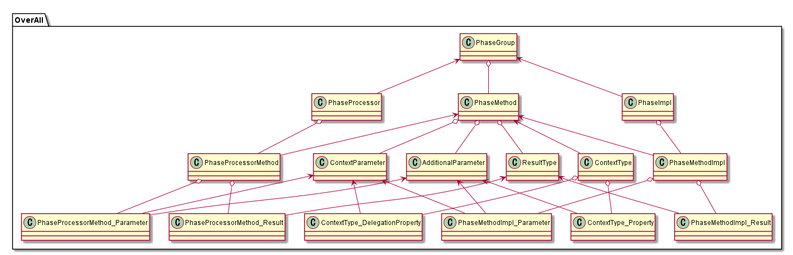
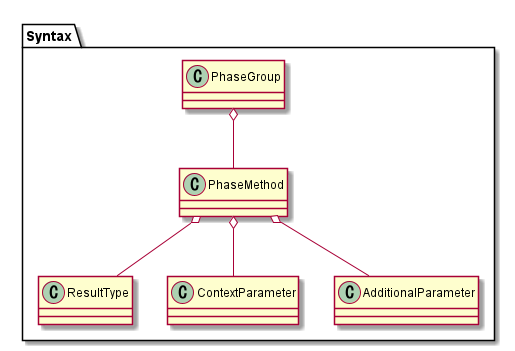
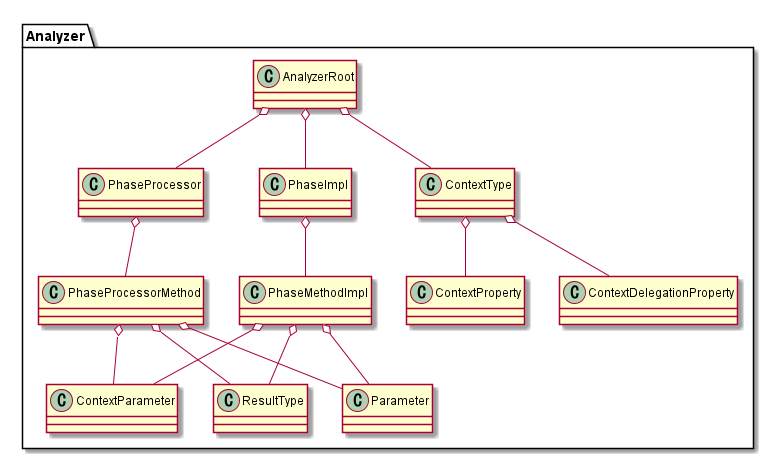
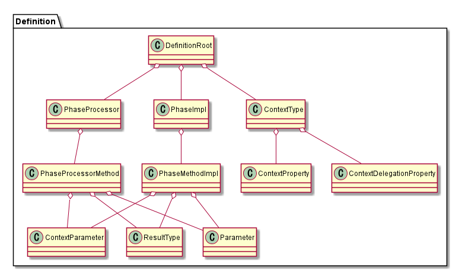

# フェーズシステム

`GameSystem2.md` の、「自動生成方針 > コンテキストクラス > メソッドから生成」を実装するための設計を考える。

## 生成方針

### 生成元

```csharp
interface IBattlePhases
{
    Task<result_type> フェーズ1(object param1, object param2);
    Task<result_type> フェーズ2(フェーズ1Context context, object additiveParam);
}
```

### 生成コード

```csharp
public class フェーズ1Context
{
    public object Param1 { get; }
    public object Param2 { get; }
}

public class フェーズ2Context
{
    public フェーズ1Context context1 { get; }
    public object Param1 => context1.Param1;
    public object Param2 => context1.Param2;
    public object additiveParam { get; }
}

public class BattlePhasesProcessor : IBattlePhases
{
    // フェーズの戻りやコンテキストの生成などの管理をする
}

public abstract class BattlePhaseLibrary
{
    protected abstract Task<result> フェーズ1Async(フェーズ1Context context, IBattlePhases processor);
    protected abstract Task<result> フェーズ2Async(フェーズ2Context context, IBattlePhases processor);
}
```

### ユーザーがオーバーライド

```csharp
public class MyBattlePhases : BattlePhaseLibrary
{
    protected override Task<result> フェーズ1Async(フェーズ1Context context, BattlePhaseProcessor processor)
    {
        var param = CalculateParam();
        return processor.フェーズ2(context, param);
    }
}
```

## 解析

### ドメインの整理

生成元は以下の情報からなる：

* フェーズのグループ: `PhaseGroup`
    * 各フェーズのメソッド: `PhaseMethod`
        * 戻り値の型: `ResultType`
        * コンテキスト引数: `ContextParameter`
        * 追加引数: `AdditionalParameter`

生成コードは以下の情報からなる：

* フェーズ処理クラス: `PhaseProcessor`
    * フェーズ処理メソッド: `PhaseProcessorMethod`
        * コンテキスト引数: `ContextParameter`
        * 追加引数: `AdditionalParameter`
        * 戻り値: `ResultType`
* フェーズ実装クラス: `PhaseImpl`
    * フェーズ実装メソッド: `PhaseMethodImpl`
        * コンテキスト引数: `ContextParameter`
        * 追加引数: `AdditionalParameter`
        * 戻り値: `ResultType`
* コンテキストクラス: `ContextType`
    * プロパティ: `Property`
    * 委譲プロパティ: `DelegationProperty`

それぞれ、以下の場所で使う：

PhaseGroup

* フェーズ処理クラスの名前
* フェーズ実装クラスの名前

PhaseMethod

* コンテキストクラスの名前
* コンテキストクラスのプロパティ
* フェーズ処理クラスのメソッドの名前
* フェーズ実装クラスの仮想メソッドの名前

ResultType

* フェーズ処理クラスのメソッドの戻り値
* フェーズ実装クラスのメソッドの戻り値

ContextParameter

* コンテキストクラスの委譲プロパティを実装する
* フェーズ処理クラスのメソッドの引数
* フェーズ実装クラスのメソッドの引数

AdditionalParameter

* コンテキストクラスのプロパティ
* フェーズ処理クラスのメソッドの引数
* フェーズ実装クラスのメソッドの引数



### コード生成のためのクラス

以下の3つのフェーズに分けてコード生成を行う。

* Syntaxフェーズ: Roslynを通じて構文を解析する
* Analyzerフェーズ: Syntaxを元にDefinitionを生成する
* Definitionフェーズ: T4テンプレートで生成するための各種データやヘルパー関数などを提供する

#### Syntaxフェーズ

コードの構造を解析するフェーズ。
`Parse`フェーズと呼ぶとよいかも。

* PhaseGroupSyntax
* PhaseMethodSyntax
* ReturnTypeSyntax
* ParameterSyntax



#### Analyzerフェーズ

コードの構造を意味に変換するフェーズ。
最終的な生成コードに必要なデータ構造を生成する。
`Interpret`フェーズと呼ぶとよいかも。

ルート

* AnalyzerRoot

処理、実装クラス

* PhaseProcessorAnalyzer
* PhaseMethodAnalyzer
* PhaseImplAnalyzer
* PhaseMethodImplAnalyzer

メソッド要素

* ReturnTypeAnalyzer
* ContextParameterAnalyzer
* ParameterAnalyzer

コンテキストクラス

* ContextTypeAnalyzer
* ContextPropertyAnalyzer
* ContextDelegationPropertyAnalyzer



#### Definitionフェーズ

コードの解釈結果をコード生成に反映させるフェーズ。
`Compile`フェーズと呼ぶと良いかも。

ルート

* DefinitionRoot

処理、実装クラス

* PhaseProcessorDefinition
* PhaseMethodDefinition
* PhaseImplDefinition
* PhaseMethodImplDefinition

メソッド要素

* ReturnTypeDefinition
* ContextParameterDefinition
* ParameterDefinition

コンテキストクラス

* ContextTypeDefinition
* ContextPropertyDefinition
* ContextDelegationPropertyDefinition

